# User Experience Design

## **[Prototype](https://www.figma.com/proto/NrtB8ONdhaRjqkqnG6YRrf/DinnerDate?node-id=30%3A96&scaling=scale-down&page-id=0%3A1&starting-point-node-id=30%3A96)**

### Login:

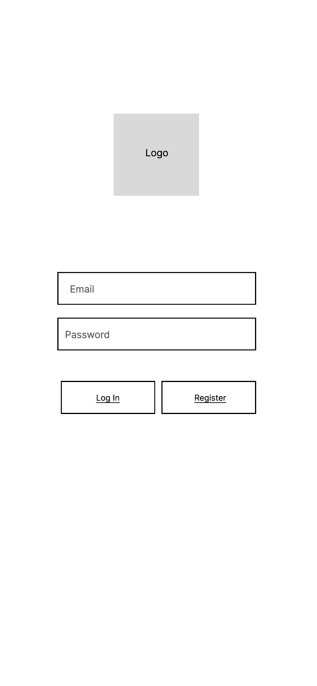

- The user must register and log in to use the app
- Login will check the user's credentials 
- Register will add the new user to the system 

### Home - Find a Date:

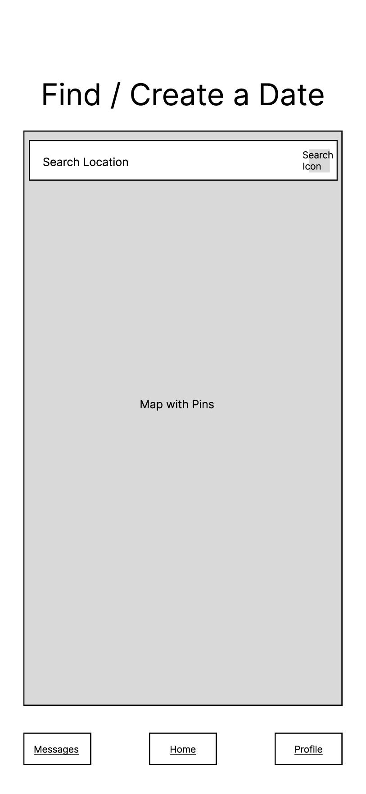

- A map is displayed with various pins on resturants where people have active posts 
- When the user chooses a restaurant, the app will direct to a page that shows information about the restaurant:

### Location Info:

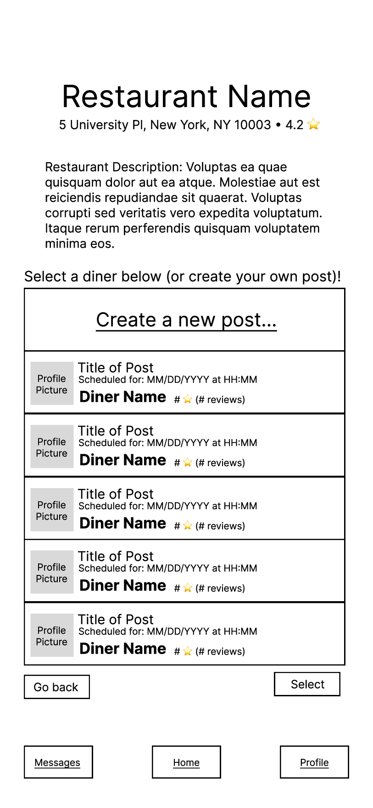

- Here, all the active posts are listed for the user to browse
- The user can either create their own post or select one of the existing dates 
- Once the user selects a date, the creator of the post will be able to accept or decline this request

### Create Post:

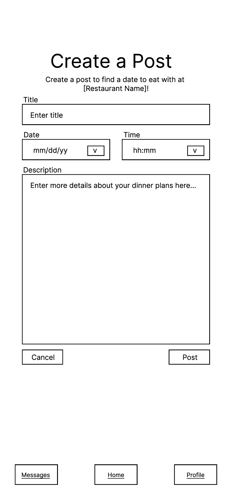

- The user can create a post at the selected resturnat by filling out the form 

### Home - Date Posted:

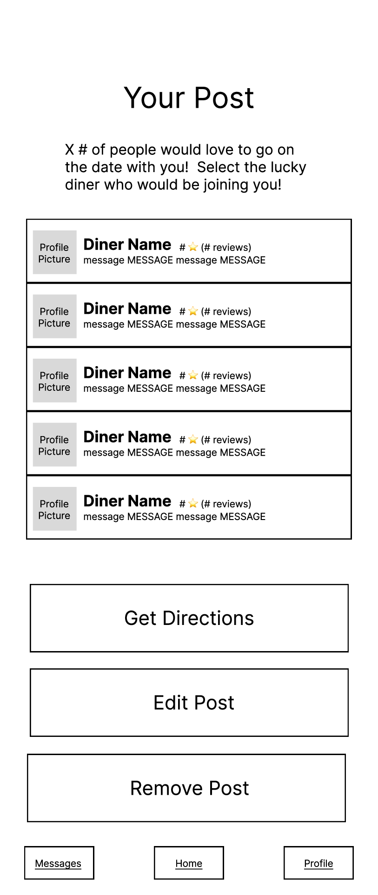

- When the user creates a post, this will become their new home screen 
- Here the user can see all the people who have responded to their post and choose one to go on a date with
- When the user clicks on a diner, you get brought to their profile

### Date Profile:

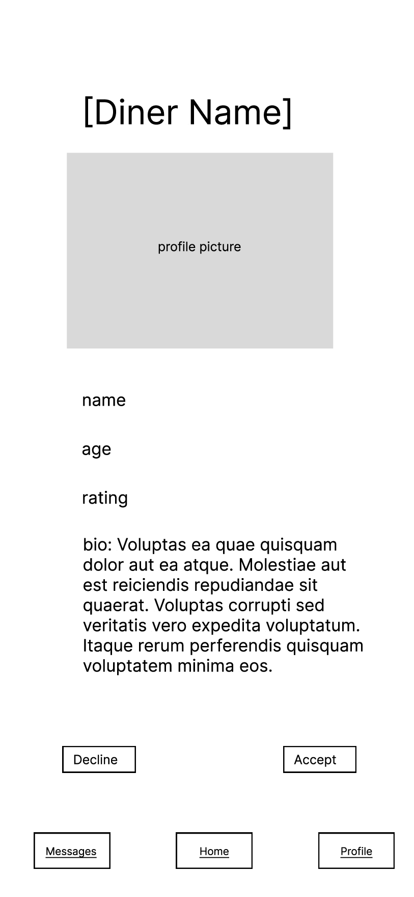

- Here the user can view the profile of the user who accepted the post 
- The user has the option to accept or decline 

### Home - Date Confirmed:

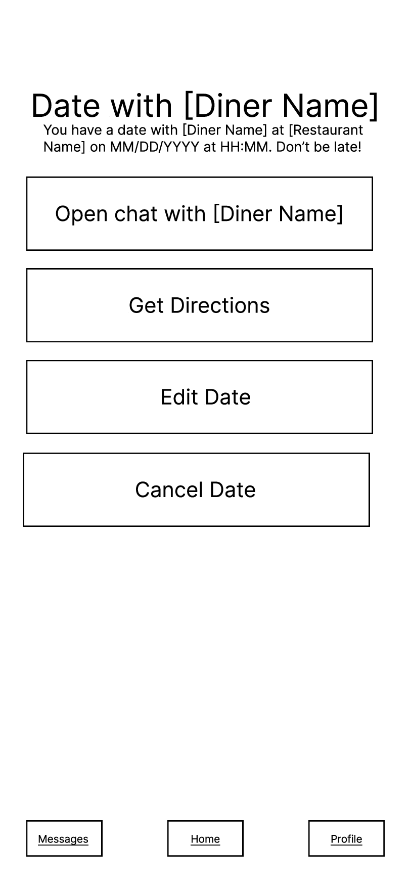

- When a date is confirmed, this will be the new home page
- Here, the user can chat with the other user, get directions to the resturant (opens google maps), edit the date, or cancel 

### Edit Post:

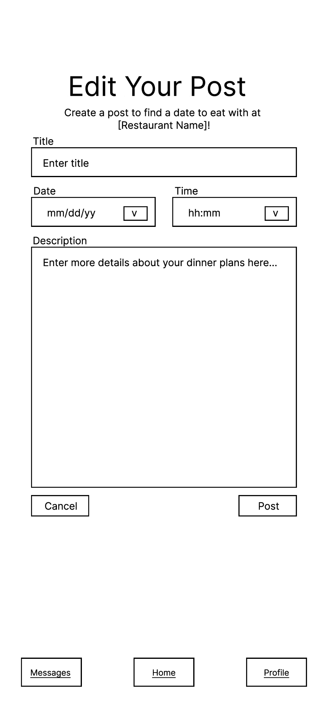

- Here the user can edit the details of their active post 

### All Conversations:

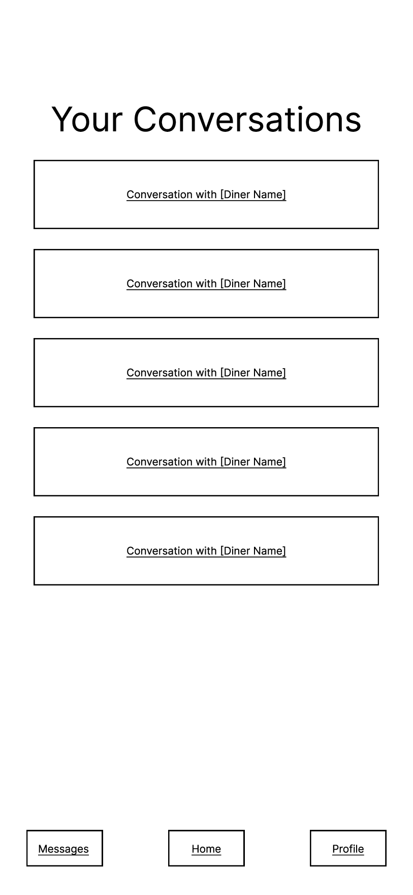

- This page displays all the user's prior and current conversations 

### Chat:

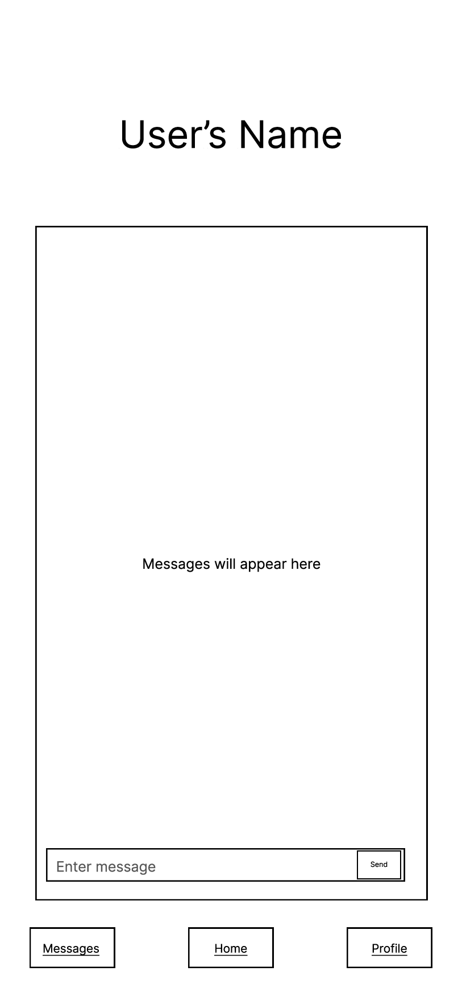

- Here is the messaging feature where users can chat with their dates 

### My Profile:

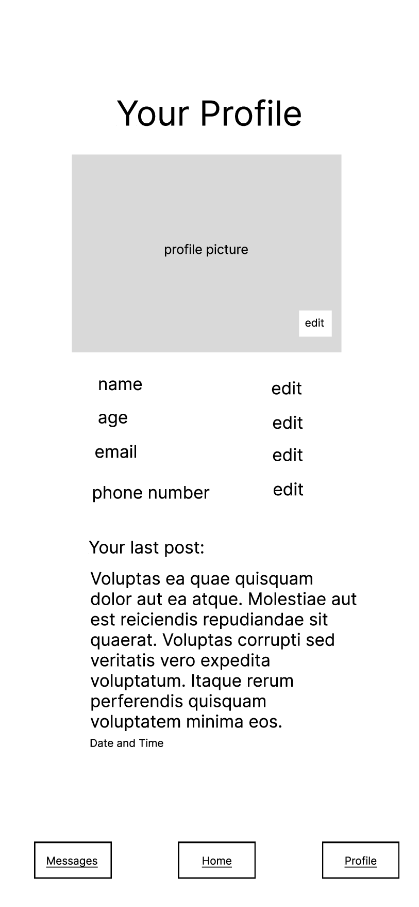

- The user's profile info is displayed here with options to edit 